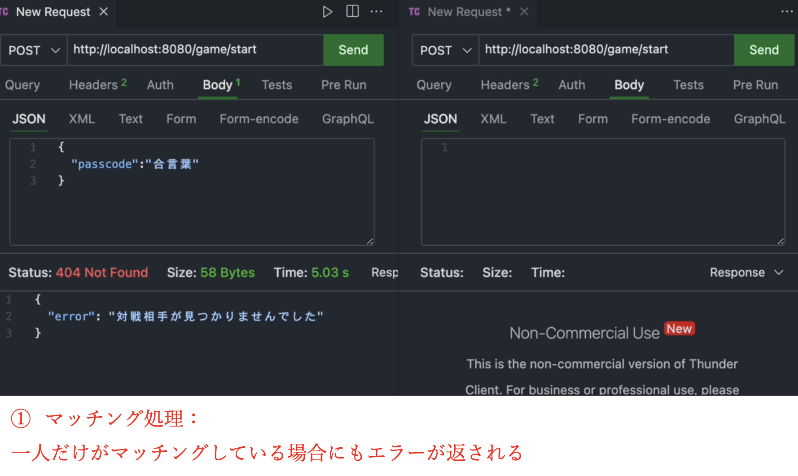
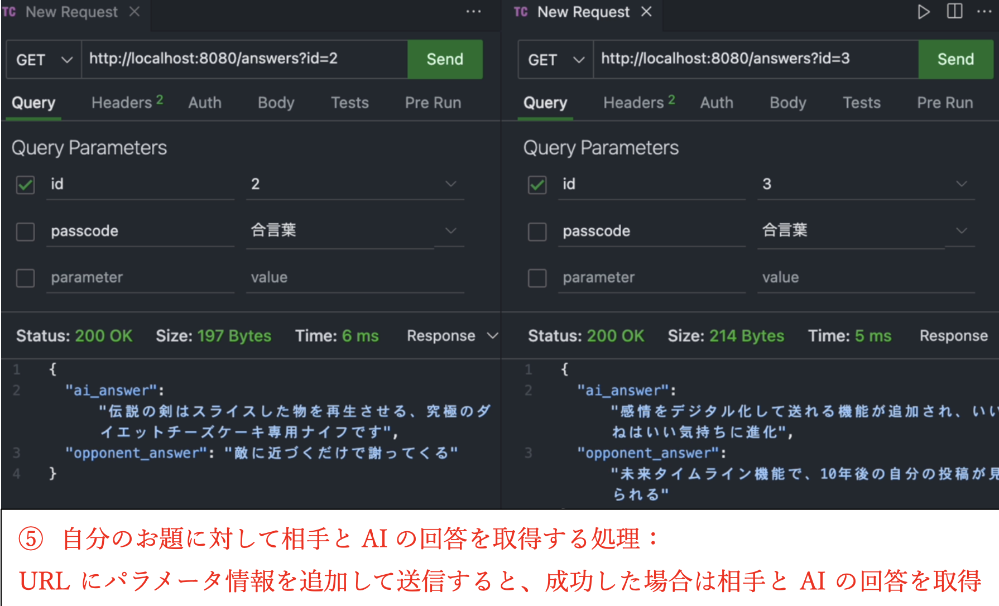

# HUMan OR AI
ハッカソン技育CAMP2024 Vol.19

発表スライド： https://docs.google.com/presentation/d/1Kywy_Jzy-XLVUDBIwsPYSnT6Sq7EmecSucU0_fmEJGk/edit?usp=sharing

デモ映像：https://youtu.be/DF7pgwGcfis

## アプリ概要
プレイヤーが同じ合言葉を入力してマッチングに成功すると、お互いに大喜利のお題を出し合います。その後、各自が回答をし、AIの回答と相手の回答が提示されます。プレイヤーは、どちらが人間の回答かを選んで当てる対戦ゲームです。

## 起動方法

### フロントエンド　（TypeScript、Next.js）:
1. Node.jsのインストール 
- https://nodejs.org/en/download/prebuilt-installer
   このURLからver20.18.1(LTS)を選択しインストール(wizardでは全てNextをクリックしてok)

2. インストールの確認
- vscodeのターミナルを開き,"node -v" "npm -v"とそれぞれ入力し、バージョンが見れる事を確認してください。

3. ディレクトリの移動
- cd コマンドでfrontendディレクトリに移動してください。

4. node_moduuesのインストール
- ターミナルでnpm iを実行してディレクトリに"node_modules"があることを確認してください。

5. プロジェクト立ち上げ
- vscodeのターミナルで"npm run dev"を実行してください。
　　無理だった場合、以下をそれぞれターミナルで実行し、再度"npm run dev"を実行してください。
- winget install Schniz.fnm
- fnm env --use-on-cd | Out-String | Invoke-Expression
- fnm use --install-if-missing 20
- 成功するとターミナルにlocalhost:3000のURLが発行されるのでクリックして開いてください。

### バックエンド（Go、Echo） :

1. ディレクトリに移動                　
- $ cd backend/ 

2. 必要なGoモジュールをインストール
- $ go mod tidy 

3. Dockerを起動
- $ docker compose up -d 

4. サーバーを起動
- $ go run cmd/main.go 

5. 動作確認

6. Dockerを停止
- $ docker compose down

## Thunder Clientを使ったAPIの動作確認例
### ①　マッチング処理-1

---
### ①　マッチング処理-2

---
### ①　マッチング処理-3

---
### ①　マッチング処理-4

---
### ①　マッチング処理-5

---
### ② お題を送信する処理

---
### ③ 相手のお題を取得する処理

---
### ④ 相手のお題に対して自分の回答を送信する処理

---
### ⑤ 自分のお題に対して相手とAIの回答を取得する処理

---
### 　⑥ どれが人間の回答なのかを選択する処理

---
### 　⑦ 相手の選択した回答を取得する処理

---
### 　⑧ ゲームを終了する処理

